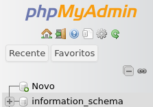
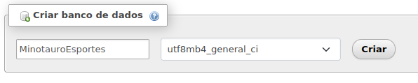
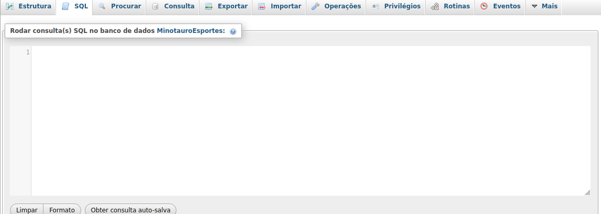
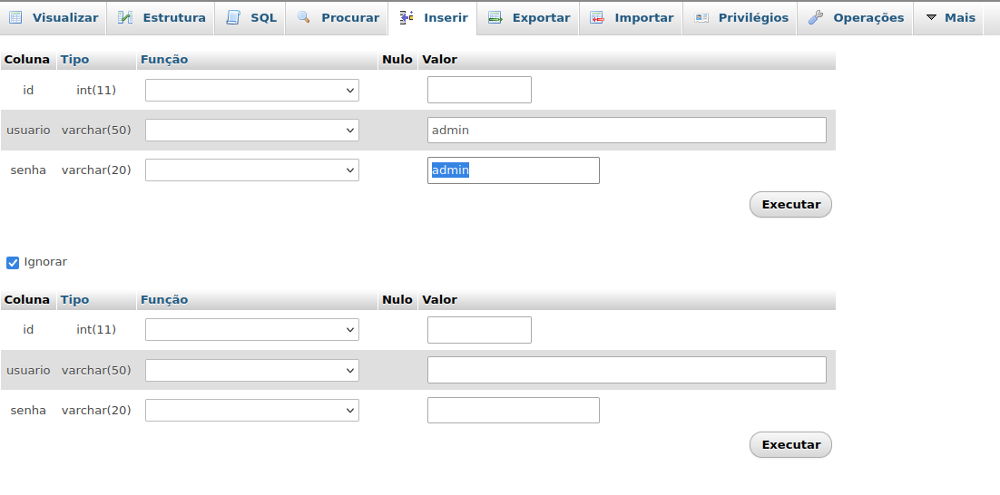

# MinotauroEsportes
Site de suplementos

# Instruções 

Para começar, abra o php my admin e clique em "novo"

Depois preencha os dados como na imagem a seguir e clique em "criar"

Depois procure a aba SQL (no contexto do banco de dados) 

Crie as tabelas cujo código está na raiz do projeto com o nome "criacao-tabelas.txt" (Crie uma por uma, não todas de uma vez)

Agora que o banco está configurado vá na tabela usuário, em inserir

E preencha com as informações da imagem. Usuário e senha admin.

Pronto, agora o banco está configurado e pronto para uso
